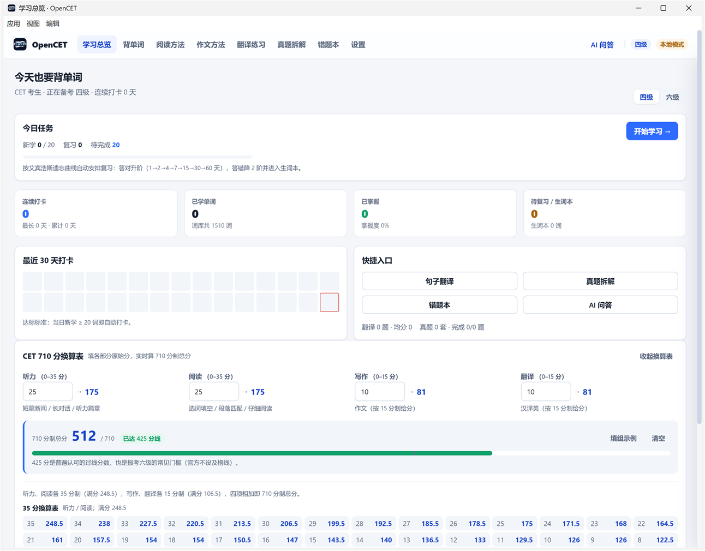
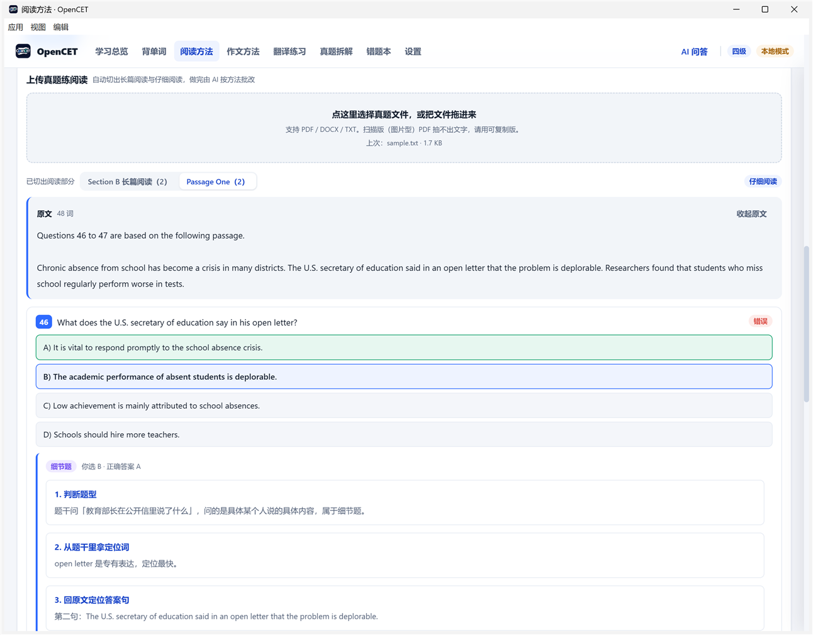
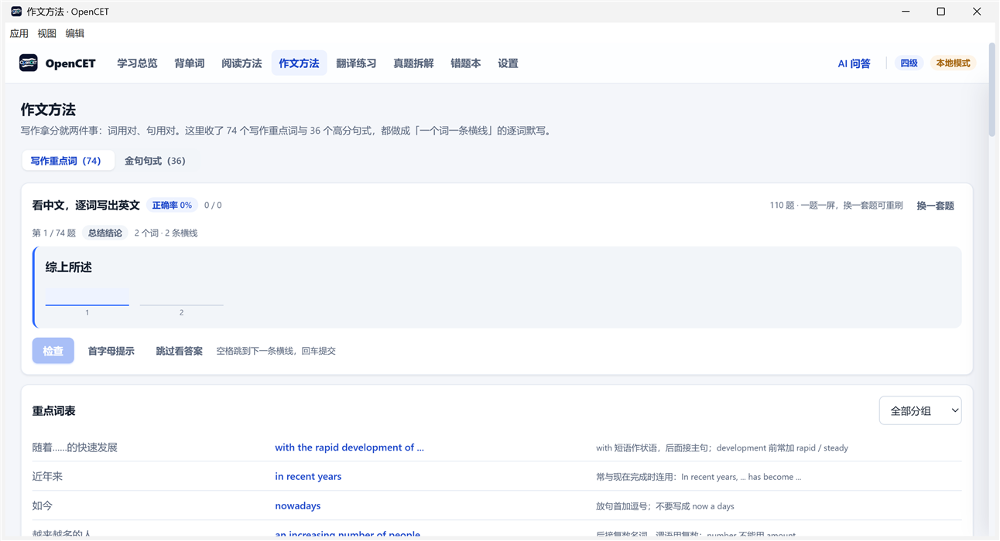
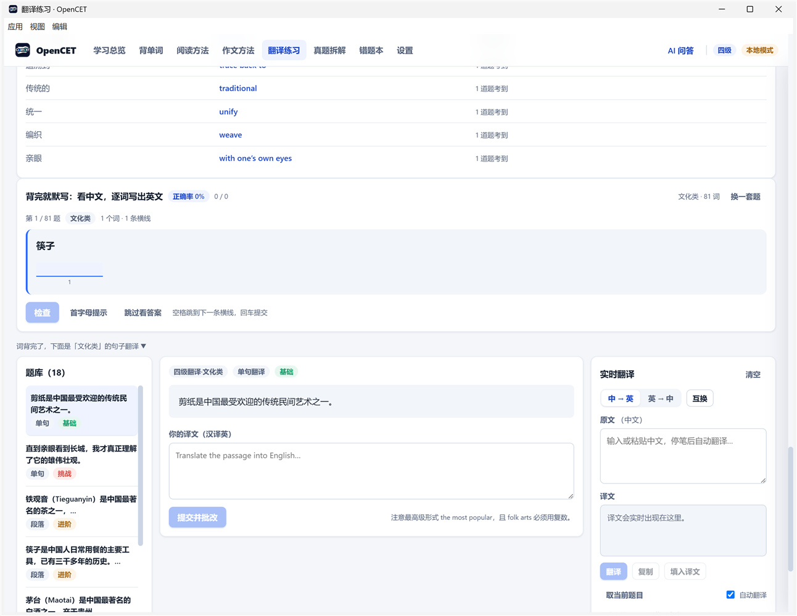
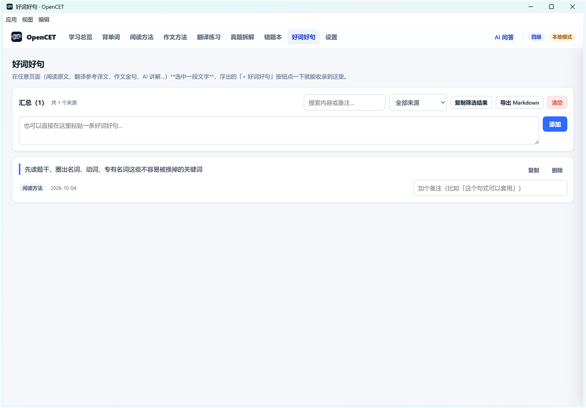

# OpenCET · 英语四六级备考平台

一个可直接运行的四六级备考网站。核心主张：**每一处讲解都按一套固定的解题方法走，而不是只报答案。**

Vue 3 + TypeScript + Vite · Spring Boot 3 + MySQL（可选）· Electron 桌面壳。
**前端不依赖后端也能完整运行**，数据存 localStorage。



## 功能

| 模块 | 做什么 |
|---|---|
| **学习总览** | 每日任务、打卡日历、词汇进度，以及 CET 710 分换算表（填原始分实时估总分，标出 425 线） |
| **背单词** | 按遗忘曲线复习：答对升阶 1→2→4→7→15→30→60 天，答错降 2 阶并进生词本 |
| **阅读方法** | 三种题型的方法讲解 + 真题逐步示范；**上传真题 PDF** 自动切出长篇阅读与仔细阅读，做完由 AI 批改 |
| **作文方法** | 74 个写作重点词 + 36 个高分句式，做成「一个词一条横线」的逐词默写；造句带拼写 + 语法本地检查 |
| **翻译练习** | 110 道真题按主题分类，先背常考词再默写再做句子翻译；含《翻译常用词汇》100 条 |
| **真题拆解** | 上传真题自动切分成模块（写作 / 听力 / 选词填空 / 长篇阅读 / 仔细阅读 / 翻译） |
| **错题本** | 翻译、真题、单词三种来源的汇总与复习 |
| **好词好句** | 任意页面**选中一段文字**，浮出按钮即可收录，支持备注、搜索、导出 Markdown |
| **AI 问答** | 右侧抽屉，19 家模型服务商预设，可挂载单词 / 翻译题 / 真题作为上下文 |

## 三个值得看的设计

**阅读批改先判题型，再按对应方法讲。** 三种题型的做法完全不同：主旨题要「只读每段第一句」，
细节题要「找定位词 → 回原文定位 → 比对同义替换」，段落匹配要「扫读找替换」。
提示词里把每种题型的步骤序列**定死**（直接取自页面上的示范），并要求每道题第一步先判断题型 ——
否则模型会偷懒一律按细节题讲。

**作文默写是逐词的，不是整句输入。** 答案有几个词就画几条横线，一个词一格：错在第几个词一眼看出。
判定忽略大小写与标点，单词笔误算对但会标出；**写错可当场重写**（只清错的格子、保留对的），也可汇总重练。

**拼写检查走近似匹配，不走词典。** 判据是「是否和某个**教学词**只差一个字母」而不是「在不在词典里」——
词典永远收不全，那样会把正常句子全标红。语法只做无歧义的硬错。
上线前用站内 146 条范文/词条验证过**零误报**。

## 快速开始

**只跑前端（零依赖，30 秒）**

```bash
cd frontend
npm install
npm run dev          # http://localhost:5173
```

不需要后端、不需要数据库，数据全部存浏览器。AI 相关功能需要自配 Key（见下）。

**完整全栈**

```bash
docker compose up -d              # 自动建库建表并导入种子数据
cd backend && ./mvnw spring-boot:run
cd frontend && npm run dev
```

后端不可用时前端会**自动回退本地模式**（导航栏显示「本地模式」角标），不会白屏。

**打包桌面应用**

```bash
cd frontend && npm run build
cd ../desktop && npm install && npm run dist      # 产物在 desktop/release/
```

## 项目结构

```
cet-master/
├── frontend/     Vue3 + TS；src/{views,components,utils,stores,api}；public/data 为生成的 JSON
├── backend/      Spring Boot 3；controller / service / mapper / entity / config
├── desktop/      Electron 壳（内置静态服务器，不是 file:// 打开）
├── tools/        16 个回归测试 + 数据生成脚本；data/ 为词库源数据，dev/ 为开发辅助
├── shared/       全项目唯一数据源 JSON（题库 / 词库 / 词表 / 换算表）
├── docs/         界面截图
└── deploy/       Nginx 配置示例
```

## 测试

```bash
bash tools/verify-parser.sh      # 16 道关卡、900+ 条断言
bash tools/verify-grader.sh      # 前后端评分规则一致性
```

覆盖：真题切分（含真实 PDF 端到端）、复习调度数学、错题本三来源、教学内容自洽、
逐词默写判定、拼写/语法检查零误报、模型输出不可信时的兜底。

两个可选环境变量用于交叉校验真实素材（真题与官方换算表有版权、不进仓库，不设则明确跳过）：

```bash
OPEN_CET_CET6_PDF="D:/真题/2025.06六级.pdf" bash tools/verify-parser.sh
```

## 常见问题

**需要 API Key 吗？** 除了 AI 相关功能，其余全部离线可用。AI 需要在「AI 问答 → 模型设置」里填自己的 Key，
内置 DeepSeek、通义千问、智谱、Kimi 等 19 家预设，选厂商即自动填好地址。

**我的 Key 会被提交/泄露吗？** 不会。Key 只存在浏览器或 Electron 的 localStorage（`opencet.ai.config`），
不写进源码、不进构建产物，请求由浏览器直连服务商、不经过本站后端。
唯一要当心的是别把 `%APPDATA%\opencet-desktop` 这个目录分享出去（里面还有学习记录与 AI 聊天历史）。

**数据存在哪？** 免注册，浏览器首次访问生成 UUID 作为身份；本地模式下全部数据在 localStorage，
接后端后由服务端持久化。

## 界面

| | |
|---|---|
|  |  |
| **阅读练习**：AI 先判题型，再按该题型的步骤讲 | **作文方法**：一个词一条横线 |
|  |  |
| **翻译练习**：分类 → 常考词 → 默写 → 句子翻译 | **好词好句**：划词收录，带来源与备注 |

更多截图在 `docs/`。

## 协议

代码：[MIT](LICENSE)。仓库内附带的历年真题原文与翻译题目版权归原考试机构所有，
**仅作个人备考学习之用，请勿商用**；词库、词表与换算表为自建整理。详见 [LICENSE](LICENSE) 末尾说明。

> 发布前建议把 `LICENSE` 里的 `Copyright (c) 2026 OpenCET` 改成你自己的名字。
